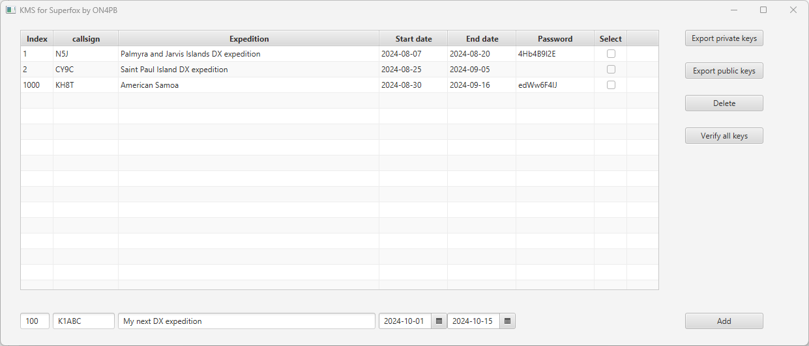

# KMS for SF - Key Management System for WSJT-X Superfox



A proposal for authenticating a WSJT-X Superfox DX expedition. 

This proposal is referred to as the PB scheme, introduced in Aug 24, when different alternatives were examined to improve the authentication of a WSJT-X Superfox.

Version 3 of the PB scheme, comes with two design options :

- option 1, where 1024 keypairs are created, and any dx expedition can be attributed a free keypair 
- option 2, where keypairs are created on request and are attributed to a callsign, as dx expeditions come on air.

This repo implements option 2 (bootstrap with an empty keystore).

Signing and verifying the CQ message is done with the BN158 curve and BLS signature available from "The MIRACL Core Cryptographic Library" at https://github.com/miracl/core/tree/master
The order of this elliptic curve is 158 points and has a security level of about 80 bits.
Native implementations are available in C, C++, Go, Rust, Python, Java, Javascript and Swift programming languages, and the library is distributed with an Apache V2 license.
See https://github.com/miracl/core/blob/master/java/TestBLS.java for a working Java example with keypair generate, sign and verify.

The proposed superfox payload is as follows :

For a standard callsign we have 269 bits available for a signature :
c28 g15 s168 u101 v3 k10 q1 i3 = 329 bits 

For a non standard callsign we have 239 bits available for a signature :
c58 g15 s168 u71 v3 k10 q1 i3 = 329 bits

New for this encoding is :

s168 : the signature

u101 or u71 : unused bits

v3 : the version of the superfox payload (values could be : 0 : not authenticated, 1 : scheme 1, 2 : a better scheme, ...)

k10 : key index (1024 values)

The signature s168 is produced from the `<date_time>|<key Index>|<CQ message>` string, or similar. 
As an example : `240817_081230|5|CQ CY9C EM20` may result in a signature "0x02191cf5a121efa04c7976cd4213b0adfc4a556d8b"

The authentication at the hound is done in real time, without the need to do an online internet lookup.
The fox does not need an internet connection.
A further design decision can be made if the hound may or may not call the fox before he is heard.

# Sequence of events 

#### 1. At the request of a DX expedition, the designated authority :

##### 1.1 creates a private key file with the requesting callsign, a new keypair, a free key index and the validity period

##### 1.2 optionally, encrypts the private key file with a strong password

##### 1.3 sends the encrypted file plus password to the DX expedition manager

##### 1.4 adds the .json entry to the private keystore. 

Example of a keystore.json with 3 DX expeditions :
```json
[ {
  "index" : 1,
  "callsign" : "N5J",
  "expedition" : "Palmyra and Jarvis Islands DX expedition",
  "startDate" : "2024-08-07",
  "endDate" : "2024-08-20",
  "privateKey" : "FfwDW32hREgACyceV5vXqfvrwbg=",
  "publicKey" : "AiKZwAUzudL7xNgBeBx3AIeWNAVSAcpyGl2yB/JgsidtV+cXjsOPLoY=",
  "password" : "4Hb4B9l2E"
}, {
  "index" : 2,
  "callsign" : "CY9C",
  "expedition" : "Saint Paul Island DX expedition",
  "startDate" : "2024-08-25",
  "endDate" : "2024-09-05",
  "privateKey" : "FaA/sYZjROJU43HgM5UxQ9Jc1VE=",
  "publicKey" : "AxBkb6kKvPgMImp1PdnbWIGTZqUuHb1lAQczlNm8Cws5lCqjhpt//Cg=",
  "password" : ""
}, {
  "index" : 1000,
  "callsign" : "KH8T",
  "expedition" : "American Samoa",
  "startDate" : "2024-08-30",
  "endDate" : "2024-09-16",
  "privateKey" : "D86QD9+WVhPfArUZHjlsw1td1YM=",
  "publicKey" : "AgFQzXgx9l5BRP3YSBhQzjJSKkwHHejw9aIlrIBGNsHq9Du5ngTs0Mk=",
  "password" : "edWw6F4IJ"
} ]
```	
##### 1.5 appends a new .json entry to the public keystore. 

Example of a publicKeyFile.json with 3 DX expeditions :	
```json
[ {
  "index" : 1,
  "callsign" : "N5J",
  "expedition" : "Palmyra and Jarvis Islands DX expedition",
  "startDate" : "2024-08-07",
  "endDate" : "2024-08-20",
  "publicKey" : "AiKZwAUzudL7xNgBeBx3AIeWNAVSAcpyGl2yB/JgsidtV+cXjsOPLoY="
}, {
  "index" : 2,
  "callsign" : "CY9C",
  "expedition" : "Saint Paul Island DX expedition",
  "startDate" : "2024-08-25",
  "endDate" : "2024-09-05",
  "publicKey" : "AxBkb6kKvPgMImp1PdnbWIGTZqUuHb1lAQczlNm8Cws5lCqjhpt//Cg="
}, {
  "index" : 1000,
  "callsign" : "KH8T",
  "expedition" : "American Samoa",
  "startDate" : "2024-08-30",
  "endDate" : "2024-09-16",
  "publicKey" : "AgFQzXgx9l5BRP3YSBhQzjJSKkwHHejw9aIlrIBGNsHq9Du5ngTs0Mk="
} ]	
```
##### 1.6 uploads the updated public keystore to the wsjtx website.
		
#### 2. At the fox side, the encrypted private key file is optionally decrypted with the strong password, and stored together with its contents.

#### 3. When the fox comes on air, he beacons the authenticated CQ message, as per the superfox payload description, at a configurable interval.

See cpp/sign.cpp for implementation details.

#### 4. RRR messages are not authenticated but the key index is included in the superfox payload, so that another genuine wsjtx fox / hound cannot interfere.

#### 5. The hound downloads, at his convenience, the latest version of the public keystore. As from now on, CQ messages are authenticated in real time.

See cpp/verify.cpp

#### 6. If a key revocation must be done before the <end_date>, the designated authority deletes the keypair from the private keystore, and re-publishes the public keystore.

# The KMS - Key Management System

Entries can be added with indexes 0 - 1023.

A private key file can optionally be encrypted with a password. Encryption is done with AES-256.

This java application runs on all recent Java versions and was tested on Java 1.8, 15 and 17.

The user interface is developed with JavaFX version 15. The GUI layout is defined in the main.fxml file and can be edited by hand, or better, with the JavaFX SceneBuilder.

In your IDE, make sure that the following jar files are on the project classpath :  
javafx-swt.jar  
javafx.base.jar  
javafx.controls.jar  
javafx.fxml.jar  
javafx.graphics.jar  
javafx.media.jar  
javafx.swing.jar  
javafx.web.jar  
as well as charm-glisten-6.0.6.jar  

The Java app can be started up as follows :
java --module-path "{your path to Java FX}\openjfx-15.0.1_windows-x64_bin-sdk\javafx-sdk-15.0.1\lib" --add-modules javafx.controls,javafx.fxml -Djava.util.logging.config.file=console_logging.properties -jar "dist\KMSforSF.jar"

# Signing at the hound

Code snippets can be extracted from cpp/sign.cpp

For compiling sign.cpp :

g++ sign.cpp miracl/core.a -o sign.exe

For producing a signature :

sign -m "240817_081230|1|CQ N5J EM20" -k privateKeyFile_1000.enc -p 4Hb4B9l2E -s signature1.bin

sign -m "240817_081230|2|CQ CY9C EM20" -k privateKeyFile_9.json -s signature2.bin


# Verifying at the fox

Code snippets can be extracted from cpp/verify.cpp

For compiling verify.cpp :

g++ verify.cpp miracl/core.a -o ver.exe

For verifying a signature :

ver.exe -m "240817_081230|1|CQ N5J EM20" -k publicKeyFile.json -s signature1.bin

ver.exe -m "240817_081230|2|CQ CY9C EM20" -k publicKeyFile.json -s signature2.bin


Remember, this proposal is for evaluating purposes, and to bring along some fresh ideas !

73's  
Erik  
ON4PB  
runningerik@gmail.com  